# PAMiW---Projekt
Projekt zrealizowany

## Backend

Backend został napisany w Java Spring. Obejmuje implementację bazy danych, udostępnienie endpointów od operacji CRUD na danych oraz autentykację poprzez jwt.
Ogólna struktura plików:
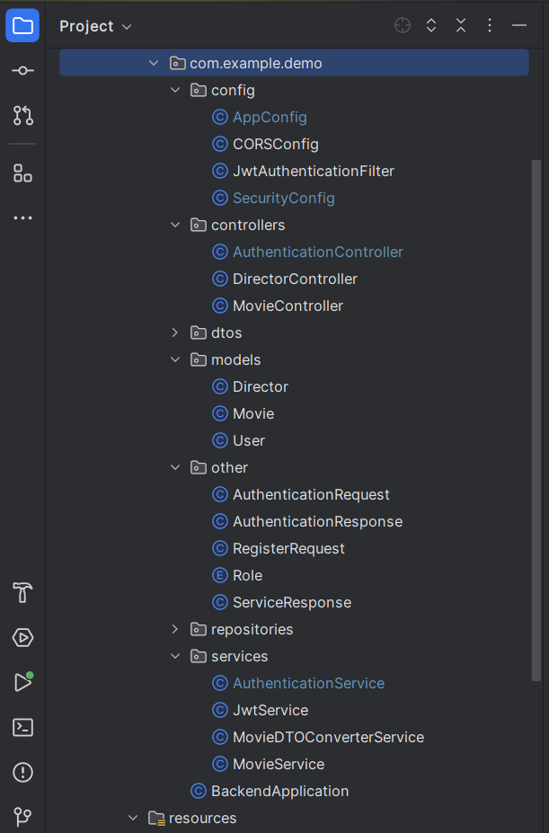 

### Hosting
Backend został zahostowany na Railway
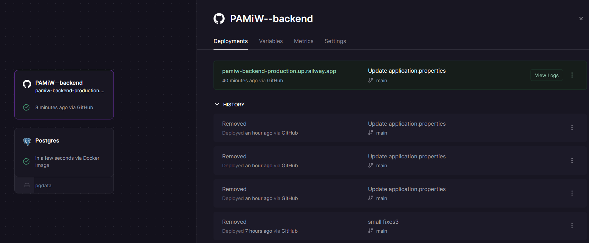
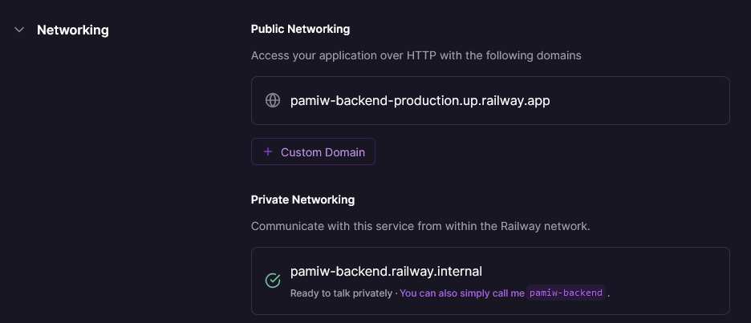

Dodanie adresu do kodu strony
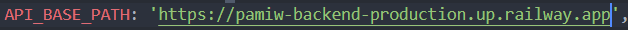

## Realizacja punktów

Implementacja logowania/rejestracji - użytkownik wybiera i wpisuje nazwę oraz hasło. Aplikacja blokuje dostęp niezalogowanym użytkownikom.
Widok ekranu przed zalogowaniem
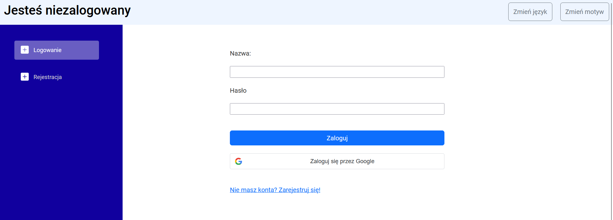

Dodano możlowość autentykacji przez Google OAuth
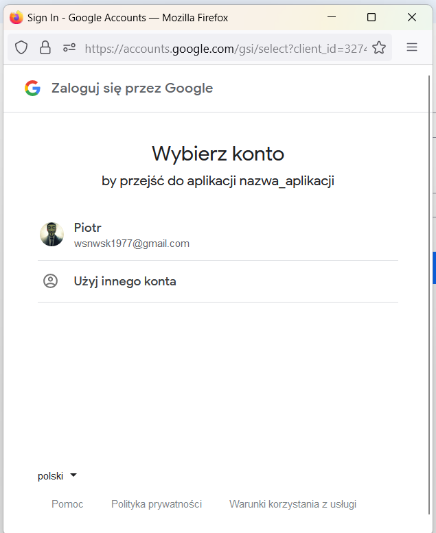

Po zalogowaniu wyświetla się widok strony głównej razem z danymi pobranymi z api po zalogowaniu

Operacje CRUD

Dodawanie  
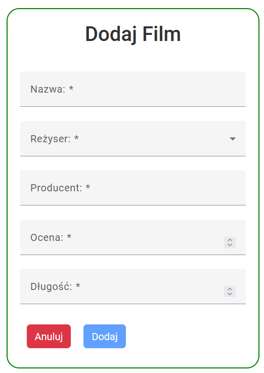

Edycja  
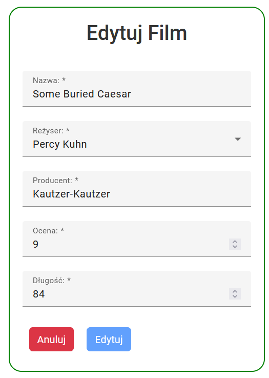

Pobieranie wykonuje się automatycznie, zanim dane przyjdą wyświetla się ikona ładowania
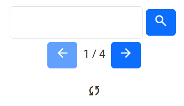

Zaimplementowane są role na backendzie, przy czym jest na stałe dwóch użytkowników ADMIN, a każdy nowy rejestrowany jest jako USER.  

Dodano możliwość zmiany motywu aplikacji
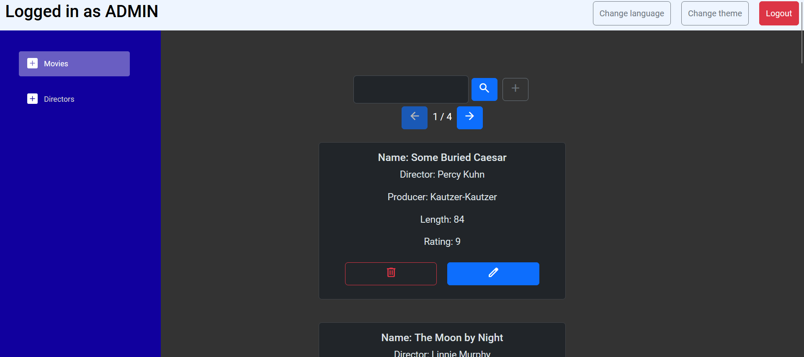

Dodano możliwość zmiany języka aplikacji  

## Aplikacja Desktopowa

Widok okna autentykacji
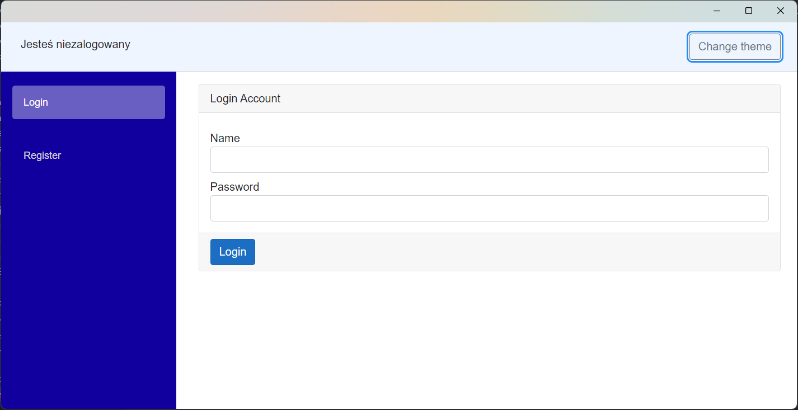

Widok okna po zalogowaniu
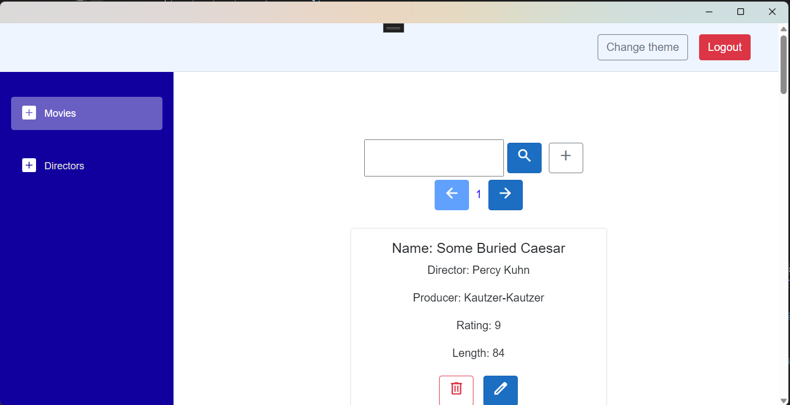