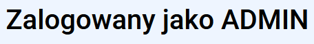
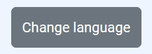

# PAMiW---Project
It is project for one of university classes. The main purpose is to make a multi-platform application for CRUD operations on some data.

## Technologies

- Angular,
- Typescript,
- Java,
- Spring,
- JWT,
- Bootstrap,
- MAUI Blazor,
- HTML,
- SCSS.

## Backend

Backend was written in Java Spring. It covers database implementation, some fictional data generation (movies and directors in this case), CRUD operations endpoints, user profile, roles, authentication and JWT.  

  
Click to see file structure

   
  
  

## Frontend

Frontend is an Angular app. It allows users to log in/register new account, browse the movies/directors lists (with search filters), add/edit/delete the movies from the list, change language, change theme. I used Bootstrap for styling. 

## Project objectives completion

  
Click to see screenshots and short description of projects main goals.

   

  Implementation of login/registration - user enters name and password. The access is blocked to users that are not logged in. Authentication window:
  

  After authentication there is home page with displayed data. Data is fetched from API. 
  

  ### CRUD Operations

  Create  
  

  Update  
  

  Fetching is done automatically, before the data is ready the loading icon is shown.  
  
 
  Roles are implemented in the backend. There are two users with ADMIN role, and every new registered user is given the USER role.  
  

  Theme changing option  
  

  Language changing option (language on the screenshot with dark theme is different than on the previous ones, that's why I didn't add another image)  
  

## Desktop Application

Desktop app is made with MAUI Blazor. It has similar features as Angular web app.

  
Click to see how the desktop application looks

   

  Authentication window
  

  After login window
  

