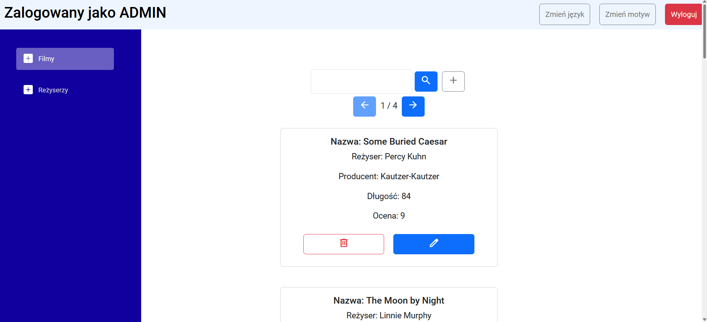

# PAMiW---Projekt
Projekt zrealizowany

## Backend

Backend został napisany w Java Spring. Obejmuje implementację bazy danych, udostępnienie endpointów od operacji CRUD na danych oraz autentykację poprzez jwt.
Ogólna struktura plików:
 

### Hosting
Backend został zahostowany na Railway

Dodanie adresu do kodu strony

## Realizacja punktów

Implementacja logowania/rejestracji - użytkownik wybiera i wpisuje nazwę oraz hasło. Aplikacja blokuje dostęp niezalogowanym użytkownikom.
Widok ekranu przed zalogowaniem

Dodano możlowość autentykacji przez Google OAuth

Po zalogowaniu wyświetla się widok strony głównej razem z danymi pobranymi z api po zalogowaniu

Operacje CRUD

Dodawanie  

Edycja  

Pobieranie wykonuje się automatycznie, zanim dane przyjdą wyświetla się ikona ładowania

Zaimplementowane są role na backendzie, przy czym jest na stałe dwóch użytkowników ADMIN, a każdy nowy rejestrowany jest jako USER.  

Dodano możliwość zmiany motywu aplikacji

Dodano możliwość zmiany języka aplikacji  

## Aplikacja Desktopowa

Widok okna autentykacji

Widok okna po zalogowaniu
